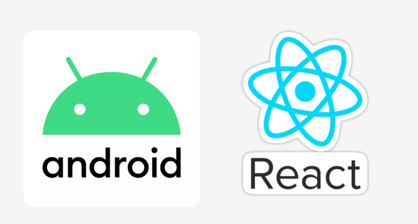
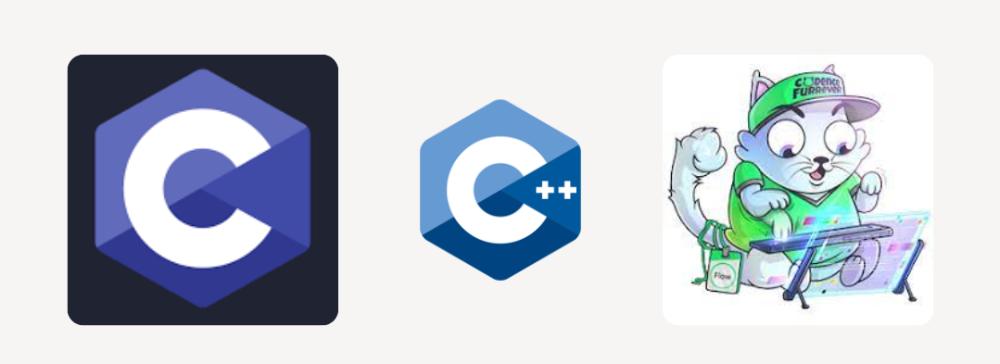

### Assalamu Alaikum reader 👋 I'm Muhammad Fahim Asim
Web 3 enthusiast and fond to mark my traces in development and engineering field of Blockchain. Being working with the Blockchain professionals, I learnt, practiced and developed smart contracts for Flow Blockchain with minimal front end and back end. I am a problem solver who always thinks about how to solve real-life problems using high-end technology. I am committed to making society free from problems by making every possible business with inherent features – Transparency, Incentivization & Decision-making rights.

### Blockchain

  
 
### Platforms and Framworks

  
 
### Programing Languages
  

Feel free to reach out on the [LinkedIn](https://www.linkedin.com/in/muhammad-fahim-asim//) directly. And if not available, email me I'll contact you asap.!

This is my CV which was last updated on `July 23rd, 2022`.
