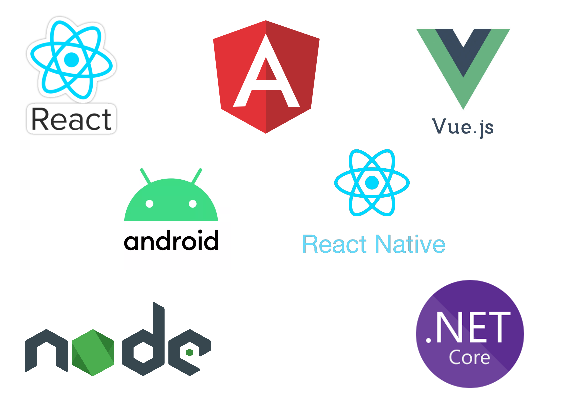
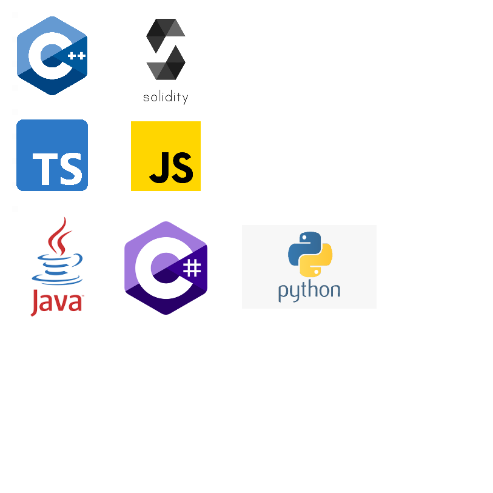

### Assalamu Alaikum reader 👋 I'm Muhammad Fahim Asim
I'm a Blockchain Developer with an experience in multiple Blockchains like EOS(Telos, WAX & its derivative chains), Flow, HyperLedger Indy, Fabric.
I am a problem solver who always thinks about how to solve real-life problems using high-end technology. I am committed to making society free from problems by making every possible business with inherent features – Transparency, Incentivization & Decision-making rights.

This is my CV which was last updated on `23-Jan-2022`.

### Blockchain
  
 
### Platforms and Framworks
  
 
### Programing Languages
  

Feel free to reach out on the [Telegram](https://t.me/@ShamGir) directly. And if not available, email me I'll contact you asap.!

          
